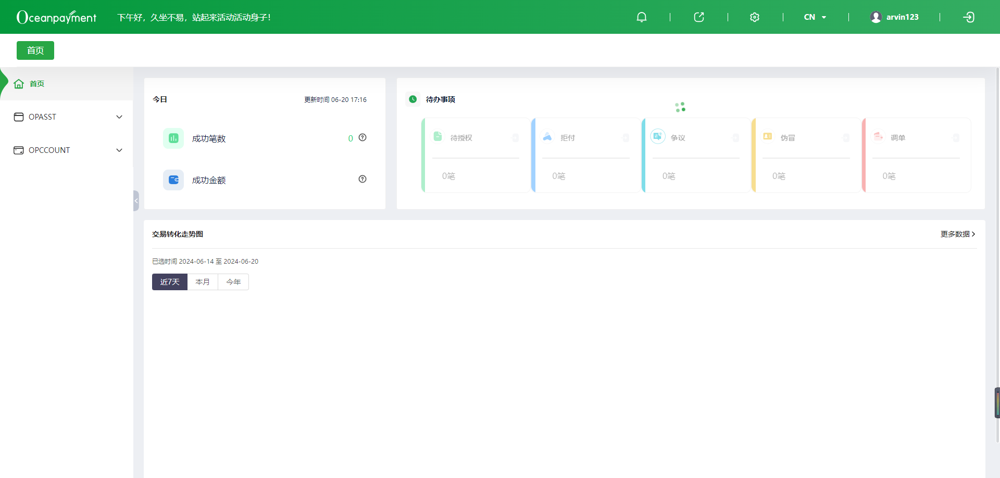

# BasicHeader
一个自定义的头部组件

## 基础用法

::: details 查看代码
```vue
<template>
  <div class="basic-header-container">
    <BasicHeader
      userName="arvin123"
      getLocale="zh-cn"
      :handleChangeLocale="handleChangeLocale"
      :handleSignOut="handleSignOut"
    >
    </BasicHeader>
  </div>
</template>

<script setup>
import { ref } from 'vue';
import { BasicHeader } from 'op-template';
/** props */

/** emits */

/** state */
/** computed */

/** watch */

/** life cycle function */

/** methods */
const handleChangeLocale = () => {};
const handleSignOut = () => {};
</script>

<style lang="less" scoped></style>

```
:::

## API
| 属性 |类型  |默认值 |说明  |
| --- | --- | --- | --- |
|userName | String | - | 用户名 |
|getLocale | String | - | 国际化key，'zh-cn'、'en-us' |
|showFullScreen | Boolean | true | 是否显示全屏 |
|showLang | Boolean | true | 是否显示国际化 |
|showUserInfo | Boolean | true | 是否显示用户名 |
|showLogout | Boolean | true | 是否显示退出登录 |
|handleSignOut  | Function | - | 退出登录的调用方法 |
|handleChangeLocale  | Function | - | 切换国际化的调用方法 |
