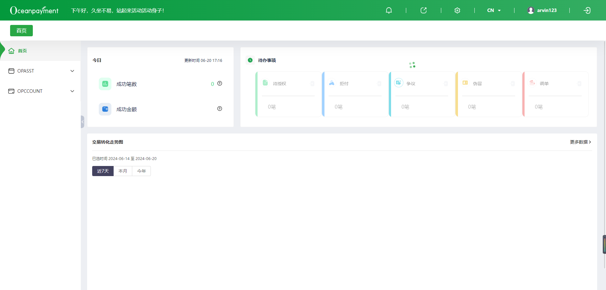
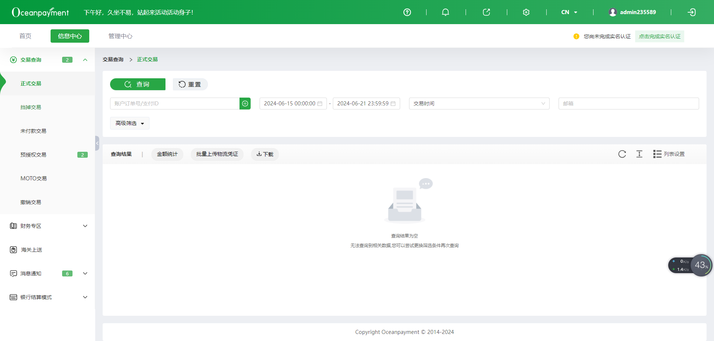
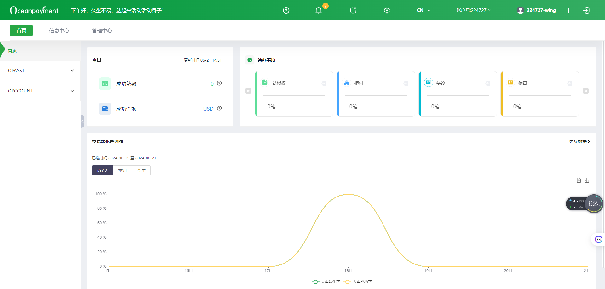

# BasicMenu
一个自定义的菜单组件


## 基础用法
传递permissionMenu菜单数据

::: details 查看代码
```vue
<template>
  <div class="basic-menu-container">
    <BasicMenu :permissionMenu="permissionMenu"></BasicMenu>
  </div>
</template>

<script setup>
import { ref } from 'vue';
import { BasicMenu } from 'op-template';
/** props */

/** emits */

/** state */
const permissionMenu = ref([
  {
    moduleNameCn: '首页',
    moduleNameEn: 'Home',
    moduleId: 0,
    nodes: [
      {
        moduleId: 761,
        moduleNameCn: '首页',
        moduleNameEn: 'Home',
        moduleParentId: 0,
        nodes: [],
        moduleType: 1,
        modelLocation: 0,
        moduleIcon: 'icon-shouye1',
        moduleUrl: '/homePageTrade',
      },
      {
        moduleId: 674,
        moduleNameCn: 'OPASST',
        moduleNameEn: 'OPASST',
        moduleParentId: 0,
        nodes: [
          {
            moduleId: 675,
            moduleNameCn: 'OPASST',
            moduleNameEn: 'OPASST',
            moduleParentId: 674,
            nodes: [],
            moduleType: 1,
            modelLocation: 0,
            moduleUrl: '/opasst/account',
          },
        ],
        moduleType: 1,
        modelLocation: 0,
        moduleIcon: 'icon-opasst',
      },
      {
        moduleId: 796,
        moduleNameCn: 'OPCCOUNT',
        moduleNameEn: 'OPCCOUNT',
        moduleParentId: 0,
        nodes: [
          {
            moduleId: 803,
            moduleNameCn: 'OPCCOUNT报表',
            moduleNameEn: 'Opccount Statement',
            moduleParentId: 796,
            nodes: [],
            moduleType: 1,
            modelLocation: 0,
            moduleUrl: '/opccount/reportForms',
          },
          {
            moduleId: 802,
            moduleNameCn: '代付账户管理',
            moduleNameEn: 'POBO Account',
            moduleParentId: 796,
            nodes: [],
            moduleType: 1,
            modelLocation: 0,
            moduleUrl: '/opccount/fundPaymentAccountManage',
          },
          {
            moduleId: 801,
            moduleNameCn: '提现账户管理',
            moduleNameEn: 'Withdrawal Account',
            moduleParentId: 796,
            nodes: [],
            moduleType: 1,
            modelLocation: 0,
            moduleUrl: '/opccount/withdrawalAccountManage',
          },
          {
            moduleId: 800,
            moduleNameCn: '代付申请',
            moduleNameEn: 'POBO Application',
            moduleParentId: 796,
            nodes: [],
            moduleType: 1,
            modelLocation: 0,
            moduleUrl: '/opccount/fundPayment',
          },
          {
            moduleId: 799,
            moduleNameCn: '自动提现',
            moduleNameEn: 'Automatic withdrawal',
            moduleParentId: 796,
            nodes: [],
            moduleType: 1,
            modelLocation: 0,
            moduleUrl: '/opccount/automaticWithdrawal',
          },
          {
            moduleId: 798,
            moduleNameCn: '提现申请',
            moduleNameEn: 'Withdrawal Application',
            moduleParentId: 796,
            nodes: [],
            moduleType: 1,
            modelLocation: 0,
            moduleUrl: '/opccount/withdrawNorate',
          },
          {
            moduleId: 797,
            moduleNameCn: '首页',
            moduleNameEn: 'Home',
            moduleParentId: 796,
            nodes: [],
            moduleType: 1,
            modelLocation: 0,
            moduleUrl: '/opccount',
          },
        ],
        moduleType: 1,
        modelLocation: 0,
        moduleIcon: 'icon-opccount',
      },
    ],
    routerUrl: '/homePageTrade',
    treeNodeList: [
      {
        moduleId: 761,
        moduleNameCn: '首页',
        moduleNameEn: 'Home',
        moduleParentId: 0,
        nodes: [],
        moduleType: 1,
        modelLocation: 0,
        moduleIcon: 'icon-shouye1',
        moduleUrl: '/homePageTrade',
        moduleIconName: 'icon-shouye1',
        routerUrl: '/homePageTrade',
        treeNodeList: [],
      },
      {
        moduleId: 674,
        moduleNameCn: 'OPASST',
        moduleNameEn: 'OPASST',
        moduleParentId: 0,
        nodes: [
          {
            moduleId: 675,
            moduleNameCn: 'OPASST',
            moduleNameEn: 'OPASST',
            moduleParentId: 674,
            nodes: [],
            moduleType: 1,
            modelLocation: 0,
            moduleUrl: '/opasst/account',
          },
        ],
        moduleType: 1,
        modelLocation: 0,
        moduleIcon: 'icon-opasst',
        moduleIconName: 'icon-opasst',
        routerUrl: '/opasst/account',
        treeNodeList: [
          {
            moduleId: 675,
            moduleNameCn: 'OPASST',
            moduleNameEn: 'OPASST',
            moduleParentId: 674,
            nodes: [],
            moduleType: 1,
            modelLocation: 0,
            moduleUrl: '/opasst/account',
            routerUrl: '/opasst/account',
            treeNodeList: [],
          },
        ],
      },
      {
        moduleId: 796,
        moduleNameCn: 'OPCCOUNT',
        moduleNameEn: 'OPCCOUNT',
        moduleParentId: 0,
        nodes: [
          {
            moduleId: 803,
            moduleNameCn: 'OPCCOUNT报表',
            moduleNameEn: 'Opccount Statement',
            moduleParentId: 796,
            nodes: [],
            moduleType: 1,
            modelLocation: 0,
            moduleUrl: '/opccount/reportForms',
          },
          {
            moduleId: 802,
            moduleNameCn: '代付账户管理',
            moduleNameEn: 'POBO Account',
            moduleParentId: 796,
            nodes: [],
            moduleType: 1,
            modelLocation: 0,
            moduleUrl: '/opccount/fundPaymentAccountManage',
          },
          {
            moduleId: 801,
            moduleNameCn: '提现账户管理',
            moduleNameEn: 'Withdrawal Account',
            moduleParentId: 796,
            nodes: [],
            moduleType: 1,
            modelLocation: 0,
            moduleUrl: '/opccount/withdrawalAccountManage',
          },
          {
            moduleId: 800,
            moduleNameCn: '代付申请',
            moduleNameEn: 'POBO Application',
            moduleParentId: 796,
            nodes: [],
            moduleType: 1,
            modelLocation: 0,
            moduleUrl: '/opccount/fundPayment',
          },
          {
            moduleId: 799,
            moduleNameCn: '自动提现',
            moduleNameEn: 'Automatic withdrawal',
            moduleParentId: 796,
            nodes: [],
            moduleType: 1,
            modelLocation: 0,
            moduleUrl: '/opccount/automaticWithdrawal',
          },
          {
            moduleId: 798,
            moduleNameCn: '提现申请',
            moduleNameEn: 'Withdrawal Application',
            moduleParentId: 796,
            nodes: [],
            moduleType: 1,
            modelLocation: 0,
            moduleUrl: '/opccount/withdrawNorate',
          },
          {
            moduleId: 797,
            moduleNameCn: '首页',
            moduleNameEn: 'Home',
            moduleParentId: 796,
            nodes: [],
            moduleType: 1,
            modelLocation: 0,
            moduleUrl: '/opccount',
          },
        ],
        moduleType: 1,
        modelLocation: 0,
        moduleIcon: 'icon-opccount',
        moduleIconName: 'icon-opccount',
        routerUrl: '/opccount/reportForms',
        treeNodeList: [
          {
            moduleId: 803,
            moduleNameCn: 'OPCCOUNT报表',
            moduleNameEn: 'Opccount Statement',
            moduleParentId: 796,
            nodes: [],
            moduleType: 1,
            modelLocation: 0,
            moduleUrl: '/opccount/reportForms',
            routerUrl: '/opccount/reportForms',
            treeNodeList: [],
          },
          {
            moduleId: 802,
            moduleNameCn: '代付账户管理',
            moduleNameEn: 'POBO Account',
            moduleParentId: 796,
            nodes: [],
            moduleType: 1,
            modelLocation: 0,
            moduleUrl: '/opccount/fundPaymentAccountManage',
            routerUrl: '/opccount/fundPaymentAccountManage',
            treeNodeList: [],
          },
          {
            moduleId: 801,
            moduleNameCn: '提现账户管理',
            moduleNameEn: 'Withdrawal Account',
            moduleParentId: 796,
            nodes: [],
            moduleType: 1,
            modelLocation: 0,
            moduleUrl: '/opccount/withdrawalAccountManage',
            routerUrl: '/opccount/withdrawalAccountManage',
            treeNodeList: [],
          },
          {
            moduleId: 800,
            moduleNameCn: '代付申请',
            moduleNameEn: 'POBO Application',
            moduleParentId: 796,
            nodes: [],
            moduleType: 1,
            modelLocation: 0,
            moduleUrl: '/opccount/fundPayment',
            routerUrl: '/opccount/fundPayment',
            treeNodeList: [],
          },
          {
            moduleId: 799,
            moduleNameCn: '自动提现',
            moduleNameEn: 'Automatic withdrawal',
            moduleParentId: 796,
            nodes: [],
            moduleType: 1,
            modelLocation: 0,
            moduleUrl: '/opccount/automaticWithdrawal',
            routerUrl: '/opccount/automaticWithdrawal',
            treeNodeList: [],
          },
          {
            moduleId: 798,
            moduleNameCn: '提现申请',
            moduleNameEn: 'Withdrawal Application',
            moduleParentId: 796,
            nodes: [],
            moduleType: 1,
            modelLocation: 0,
            moduleUrl: '/opccount/withdrawNorate',
            routerUrl: '/opccount/withdrawNorate',
            treeNodeList: [],
          },
          {
            moduleId: 797,
            moduleNameCn: '首页',
            moduleNameEn: 'Home',
            moduleParentId: 796,
            nodes: [],
            moduleType: 1,
            modelLocation: 0,
            moduleUrl: '/opccount',
            routerUrl: '/opccount',
            treeNodeList: [],
          },
        ],
      },
    ],
  },
]);
/** computed */

/** watch */

/** life cycle function */

/** methods */
</script>
```
:::

## 菜单显示消息数
传递showMessageList菜单消息信息

::: details 查看代码
```vue
<template>
  <div class="basic-menu-container">
    <BasicMenu :showMessageList="showMessageList"></BasicMenu>
  </div>
</template>

<script setup>
import { reactive } from 'vue';
import { BasicMenu } from 'op-template';
/** props */

/** emits */

/** state */
const showMessageList = reactive({
  repudiateTransactions: 0,
  phishingTrading: 0,
  disputeTransactions: 0,
  retrievalTransactions: 0,
  'pre-authorization': 2,
  messageList: 0, //系统通告
  chargebackNotice: 3, //拒付通知
  fraudNotice: 1, //伪冒通知
  retrievalNotice: 2, //调单通知
});
/** computed */

/** watch */

/** life cycle function */

/** methods */
</script>
```
:::

## 是否显示菜单图标
传递showMenuIcon控制是否显示菜单图标

::: details 查看代码
```vue
<template>
  <div class="basic-menu-container">
    <BasicMenu :showMenuIcon="showMenuIcon"></BasicMenu>
  </div>
</template>

<script setup>
import { ref } from 'vue';
import { BasicMenu } from 'op-template';
/** props */

/** emits */

/** state */
const showMenuIcon = ref(false);
/** computed */

/** watch */

/** life cycle function */

/** methods */
</script>
```
:::


## API
| 属性 |类型  |默认值  |说明  |
| --- | --- | --- | --- |
|onListenMenuCollapsed | Function | - | 监听左侧菜单展开或收起的事件 |
|permissionMenu | Array | [] | 权限菜单 |
|showMenuIcon | Boolean | false | 是否显示菜单icon |
|childrenField | String | 'treeNodeList' | 菜单children字段名字 |
|showLang | Boolean | true | 是否显示国际化, 传true内部会调用useI18n()获取locale来取对应中文或英文菜单名， 传false的话默认取中文菜单名 |
|showMessageList | Object | {}，key为路径，value为消息数 | 菜单消息数 |
